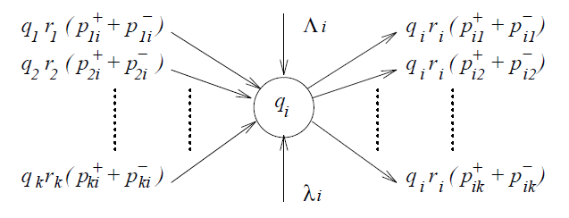
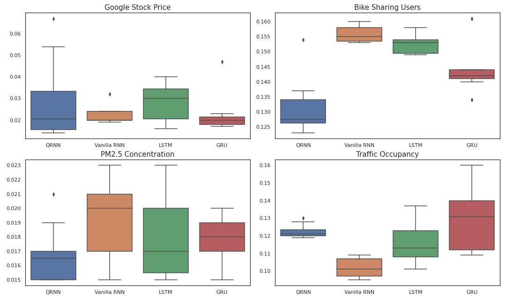

# Queueing Recurrent Neural Network (Q-RNN) [](https://www.python.org/)

**Queueing Recurrent Neural Network (Q-RNN)** is a new kind of Artificial Neural Network that has been designed to use in time-series forecasting applications. According to experiments that have been run, QRNN has a potential to outperform the LSTM, Simple RNN and GRU, in the cases where the dataset has highly non-linear characteristics.

# Table of contents

- [What is Q-RNN?](#whatisqrnn)
- [Comparison](#comparison)
- [Installation](#installation)
- [Usage](#usage)
- [License](#license)

## What is Q-RNN? 🤔 <a name="whatisqrnn"></a>


(Look of a Random Neuron [4])

It is a compose of [Simple RNN](https://github.com/bilkosem/simple-rnn_from_scratch) and [Random Neural Network](https://github.com/bilkosem/random_neural_network). Queueing RNN uses the fundamental math of Queueing Theory and G-Queues while combining it with the powerful architecture of Recurrent Neural Networks. For more detailed explanation about the theoretical background of QRNN check the [mathematical-model](https://github.com/bilkosem/queueing-rnn/tree/master/mathematical-model) folder and references section. 

## Comparison 📊 <a name="comparison"></a>

In order to evaluate the performance of QRNN, it has been compared with LSTM, GRU and Simple RNN using Keras with TensorFlow backend. During the experiments, 4 different data sets ([google stock price](https://www.kaggle.com/medharawat/google-stock-price), [bike sharing](https://archive.ics.uci.edu/ml/datasets/bike+sharing+dataset), [pm2.5 concentration](https://archive.ics.uci.edu/ml/datasets/Beijing+PM2.5+Data), [traffic volume](https://archive.ics.uci.edu/ml/datasets/Metro+Interstate+Traffic+Volume)) and 10 different optimization algorithms have been used. The mean square error distribution on the test set is given in the image below. As it seems QRNN manages to reach 3 lowest rms error out of 4. 



Check the [test_results](https://github.com/bilkosem/queueing-rnn/tree/master/test_results) folder to see detailed results 🔎.

## Installation 🛠 <a name="installation"></a>

Installing via [pip](https://pip.pypa.io/en/stable/) package manager:

```bash
pip install queueing-rnn
```

Installing via GitHub:

```bash
git clone https://github.com/bilkosem/queueing-rnn
cd queueing-rnn
python setup.py install
```

## Usage 👩‍💻 <a name="usage"></a>

```python
from queueing_rnn import QRNN

data=data.reshape((samples,timesteps,features))
qrnn = QRNN([features, hidden neurons, output neurons]) # Shape of the network

for s in range(samples):
    qrnn.feedforward()
    # Calculate Loss
    qrnn.backpropagation()
```
Check the [examples](https://github.com/bilkosem/queueing-rnn/tree/master/examples) folder to see detailed use 🔎.
## References 📚 <a name="references"></a>

[1] [Gelenbe, Erol. (1989). Random Neural Networks with Negative and Positive Signals and Product Form Solution. Neural Computation - NECO. 1. 502-510. 10.1162/neco.1989.1.4.502.](https://www.researchgate.net/publication/239294946_Random_Neural_Networks_with_Negative_and_Positive_Signals_and_Product_Form_Solution) 

[2] [Gelenbe, Erol. (1993). Learning in the Recurrent Random Neural Network. Neural Computation. 5. 154-164. 10.1162/neco.1993.5.1.154.](https://www.researchgate.net/publication/220499635_Learning_in_the_Recurrent_Random_Neural_Network)

[3] [Basterrech, S., & Rubino, G. (2015). Random Neural Network Model for Supervised Learning Problems. Neural Network World, 25, 457-499.](https://www.semanticscholar.org/paper/Random-neural-network-model-for-supervised-learning-Basterrech-Rubino/b2ebb88e1d78c726aab274ec149d65e86999cbef)

[4] [Hossam Abdelbaki (2020). rnnsimv2.zip (https://www.mathworks.com/matlabcentral/fileexchange/91-rnnsimv2-zip), MATLAB Central File Exchange. Retrieved September 22, 2020.](https://www.mathworks.com/matlabcentral/fileexchange/91-rnnsimv2-zip?s_tid=FX_rc1_behav)


## License <a name="license"></a>

[](https://github.com/Naereen/StrapDown.js/blob/master/LICENSE)
